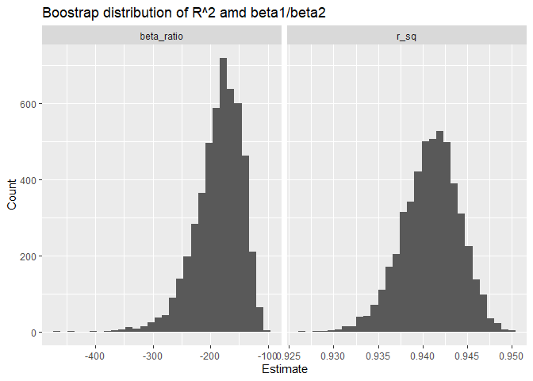

p8105_hw5_rl3616
================
Ruipeng Li
2025-12-02

``` r
library(tidyverse)
```

    ## ── Attaching core tidyverse packages ──────────────────────── tidyverse 2.0.0 ──
    ## ✔ dplyr     1.1.4     ✔ readr     2.1.5
    ## ✔ forcats   1.0.0     ✔ stringr   1.5.2
    ## ✔ ggplot2   4.0.0     ✔ tibble    3.3.0
    ## ✔ lubridate 1.9.4     ✔ tidyr     1.3.1
    ## ✔ purrr     1.1.0     
    ## ── Conflicts ────────────────────────────────────────── tidyverse_conflicts() ──
    ## ✖ dplyr::filter() masks stats::filter()
    ## ✖ dplyr::lag()    masks stats::lag()
    ## ℹ Use the conflicted package (<http://conflicted.r-lib.org/>) to force all conflicts to become errors

``` r
library(broom)
library(modelr)
```

    ## 
    ## Attaching package: 'modelr'
    ## 
    ## The following object is masked from 'package:broom':
    ## 
    ##     bootstrap

## Problem 1

``` r
homicides <- read.csv("data/homicide-data.csv")

homicides_df <- homicides |> 
  janitor::clean_names() |>
  mutate(
    city_state = str_c(city, ", ", state),
    resolved = ifelse(disposition == "Closed by arrest", 1, 0),
    victim_age = str_trim(victim_age),
    victim_age = na_if(victim_age, "Unknown"),
    victim_age = parse_number(victim_age)
  ) |> 
  filter(
    !city_state %in% c("Dallas, TX", "Phoenix, AZ", "Kansas City, MO", "Tulsa, AL"),
    victim_race %in% c("White", "Black")
    )
```

``` r
baltimore_mod <- homicides_df |>
  filter(city_state == "Baltimore, MD")

baltimore_mod <- glm(
  resolved ~ victim_age + victim_sex + victim_race,
  data = homicides_df,
  family = binomial
)

broom::tidy(baltimore_mod, exponentiate = TRUE, conf.int = TRUE) |> 
  filter(term == "victim_sexMale")
```

    ## # A tibble: 1 × 7
    ##   term           estimate std.error statistic  p.value conf.low conf.high
    ##   <chr>             <dbl>     <dbl>     <dbl>    <dbl>    <dbl>     <dbl>
    ## 1 victim_sexMale    0.603    0.0296     -17.1 1.49e-65    0.569     0.639

``` r
city_results <- homicides_df |>
  group_by(city_state) |>
  nest() |>
  mutate(
    model = map(data, ~ glm(
      resolved ~ victim_age + victim_sex + victim_race,
      data = .x,
      family = binomial
    )),
    tidy = map(model, ~ tidy(.x, exponentiate = TRUE, conf.int = TRUE))
  ) |>   #Seems I got correct result, but an unknown warning occurred.
  unnest(tidy) |>
  filter(term == "victim_sexMale") |> 
  select(-data, -model)
```

    ## Warning: There were 43 warnings in `mutate()`.
    ## The first warning was:
    ## ℹ In argument: `tidy = map(model, ~tidy(.x, exponentiate = TRUE, conf.int =
    ##   TRUE))`.
    ## ℹ In group 1: `city_state = "Albuquerque, NM"`.
    ## Caused by warning:
    ## ! glm.fit: fitted probabilities numerically 0 or 1 occurred
    ## ℹ Run `dplyr::last_dplyr_warnings()` to see the 42 remaining warnings.

``` r
city_results |> 
  ggplot(aes(
    x = fct_reorder(city_state, estimate),
    y = estimate
  )) +
  geom_point() +
  geom_errorbar(aes(ymin = conf.low, ymax = conf.high), width = 0.2) +
  coord_flip() +
  labs(
    x = "City",
    y = "Adjusted OR (Male vs Female)",
    title = "Adjusted Odds Ratios of Solved Homicides by City"
  )
```

<!-- -->

According to the chart, most cities have odds ratios less than 1 for the
“male vs female” contrast. Since female victims serve as the reference
category in the model, an OR \< 1 indicates that homicide cases
involving male victims are less likely to be solved. In other words,
cases with female victims tend to have higher odds of being solved in
most cities.

## Problem 2

``` r
library(p8105.datasets)
data("weather_df")

set.seed(123)

weather_boot <- weather_df |> 
  bootstrap(n = 5000, id = "strap_id")
```

``` r
boot_results <- weather_boot |>
  mutate(
    model  = map(strap, ~ lm(tmax ~ tmin + prcp, data = .x)),
    glnc   = map(model, glance),   # get R^2
    tidy   = map(model, tidy)      # get betas
  ) |>
  mutate(
    r_sq = map_dbl(glnc, "r.squared"),
    beta_ratio = map_dbl(tidy, ~ {
      b1 = .x |> filter(term == "tmin") |> pull(estimate)
      b2 = .x |> filter(term == "prcp") |> pull(estimate)
      b1 / b2
    })
  ) |>
  select(strap_id, r_sq, beta_ratio)
```

``` r
boot_results |>
  pivot_longer(r_sq:beta_ratio,
               names_to = "param",
               values_to = "estimate") |>
  ggplot(aes(x = estimate)) +
  geom_histogram() +
  facet_wrap(~ param, scales = "free_x") +
  labs(x = "Estimate", y = "Count",
       title = "Boostrap distribution of R^2 amd beta1/beta2")
```

    ## `stat_bin()` using `bins = 30`. Pick better value `binwidth`.

<!-- -->
